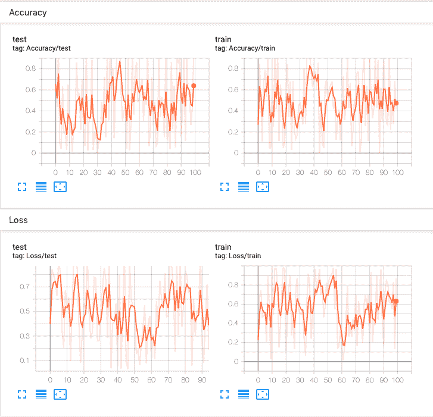
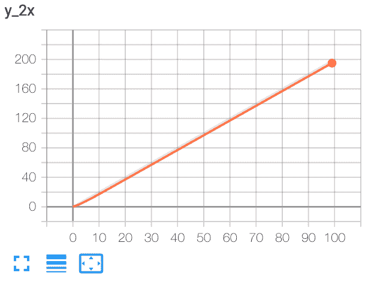
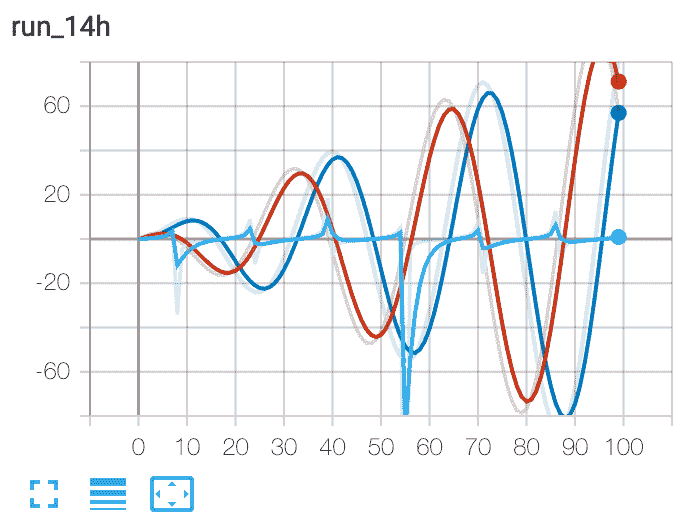
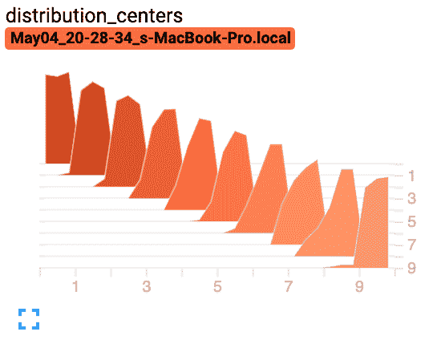
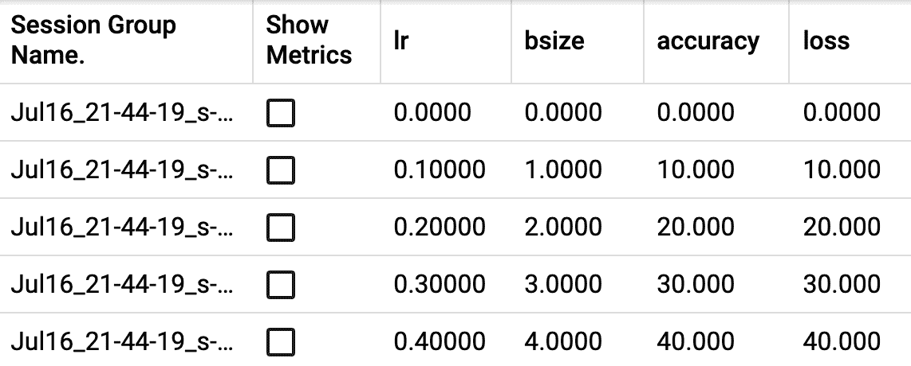

# torch.utils.tensorboard

> 原文： [https://pytorch.org/docs/stable/tensorboard.html](https://pytorch.org/docs/stable/tensorboard.html)

在继续之前，可以在 [https://www.tensorflow.org/tensorboard/](https://www.tensorflow.org/tensorboard/) 上找到有关 TensorBoard 的更多详细信息。

安装 TensorBoard 后，这些实用程序使您可以将 PyTorch 模型和指标记录到目录中，以便在 TensorBoard UI 中进行可视化。 PyTorch 模型和张量以及 Caffe2 网络和 Blob 均支持标量，图像，直方图，图形和嵌入可视化。

SummaryWriter 类是您用来登录数据以供 TensorBoard 使用和可视化的主要条目。 例如：

```
import torch
import torchvision
from torch.utils.tensorboard import SummaryWriter
from torchvision import datasets, transforms

# Writer will output to ./runs/ directory by default
writer = SummaryWriter()

transform = transforms.Compose([transforms.ToTensor(), transforms.Normalize((0.5,), (0.5,))])
trainset = datasets.MNIST('mnist_train', train=True, download=True, transform=transform)
trainloader = torch.utils.data.DataLoader(trainset, batch_size=64, shuffle=True)
model = torchvision.models.resnet50(False)
# Have ResNet model take in grayscale rather than RGB
model.conv1 = torch.nn.Conv2d(1, 64, kernel_size=7, stride=2, padding=3, bias=False)
images, labels = next(iter(trainloader))

grid = torchvision.utils.make_grid(images)
writer.add_image('images', grid, 0)
writer.add_graph(model, images)
writer.close()

```

然后可以使用 TensorBoard 对其进行可视化，该 TensorBoard 应该可通过以下方式安装和运行：

```
pip install tensorboard
tensorboard --logdir=runs

```

一个实验可以记录很多信息。 为了避免 UI 混乱和更好地将结果聚类，我们可以通过对图进行分层命名来对图进行分组。 例如，“损失/训练”和“损失/测试”将被分组在一起，而“准确性/训练”和“准确性/测试”将在 TensorBoard 界面中分别分组。

```
from torch.utils.tensorboard import SummaryWriter
import numpy as np

writer = SummaryWriter()

for n_iter in range(100):
    writer.add_scalar('Loss/train', np.random.random(), n_iter)
    writer.add_scalar('Loss/test', np.random.random(), n_iter)
    writer.add_scalar('Accuracy/train', np.random.random(), n_iter)
    writer.add_scalar('Accuracy/test', np.random.random(), n_iter)

```

预期结果：

[](_images/hier_tags.png)

* * *

```
class torch.utils.tensorboard.writer.SummaryWriter(log_dir=None, comment='', purge_step=None, max_queue=10, flush_secs=120, filename_suffix='')¶
```

将条目直接写入 log_dir 中的事件文件，以供 TensorBoard 使用。

&lt;cite&gt;SummaryWriter&lt;/cite&gt; 类提供了一个高级 API，用于在给定目录中创建事件文件并向其中添加摘要和事件。 该类异步更新文件内容。 这允许训练程序从训练循环中调用直接将数据添加到文件的方法，而不会减慢训练速度。

* * *

```
__init__(log_dir=None, comment='', purge_step=None, max_queue=10, flush_secs=120, filename_suffix='')¶
```

创建一个 &lt;cite&gt;SummaryWriter&lt;/cite&gt; ，它将事件和摘要写到事件文件中。

参数

*   **log_dir** (_字符串_）–保存目录位置。 默认值为运行次数/ **CURRENT_DATETIME_HOSTNAME** ，每次运行后都会更改。 使用分层文件夹结构可以轻松比较运行情况。 例如 为每个新实验传递“ runs / exp1”，“ runs / exp2”等，以便在它们之间进行比较。

*   **注释**(_字符串_）–注释 log_dir 后缀附加到默认值`log_dir`。 如果分配了`log_dir`，则此参数无效。

*   **purge_step**  (_python：int_ )–当日志记录在步骤崩溃并在步骤重新启动时，将清除 global_step 大于或等于的所有事件， 隐藏在 TensorBoard 中。 请注意，崩溃的实验和恢复的实验应具有相同的`log_dir`。

*   **max_queue**  (_python：int_ )–在“添加”调用之一强行刷新到磁盘之前，未决事件和摘要的队列大小。 默认值为十个项目。

*   **flush_secs**  (_python：int_ )–将挂起的事件和摘要刷新到磁盘的频率(以秒为单位）。 默认值为每两分钟一次。

*   **filename_suffix** (_字符串_）–后缀添加到 log_dir 目录中的所有事件文件名中。 在 tensorboard.summary.writer.event_file_writer.EventFileWriter 中有关文件名构造的更多详细信息。

例子：

```
from torch.utils.tensorboard import SummaryWriter

# create a summary writer with automatically generated folder name.
writer = SummaryWriter()
# folder location: runs/May04_22-14-54_s-MacBook-Pro.local/

# create a summary writer using the specified folder name.
writer = SummaryWriter("my_experiment")
# folder location: my_experiment

# create a summary writer with comment appended.
writer = SummaryWriter(comment="LR_0.1_BATCH_16")
# folder location: runs/May04_22-14-54_s-MacBook-Pro.localLR_0.1_BATCH_16/

```

* * *

```
add_scalar(tag, scalar_value, global_step=None, walltime=None)¶
```

将标量数据添加到摘要中。

Parameters

*   **标记**(_字符串_）–数据标识符

*   **标量值** (_python：float_ _或_ _字符串/名称_）–要保存的值

*   **global_step**  (_python：int_ )–要记录的全局步长值

*   **walltime**  (_python：float_ )–可选，以事件发生后的秒数覆盖默认的 walltime(time.time(））

Examples:

```
from torch.utils.tensorboard import SummaryWriter
writer = SummaryWriter()
x = range(100)
for i in x:
    writer.add_scalar('y=2x', i * 2, i)
writer.close()

```

Expected result:

[](_images/add_scalar.png)

* * *

```
add_scalars(main_tag, tag_scalar_dict, global_step=None, walltime=None)¶
```

将许多标量数据添加到摘要中。

请注意，此函数还将已记录的标量保存在内存中。 在极端情况下，它会炸毁您的 RAM。

Parameters

*   **main_tag** (_字符串_）–标记的父名称

*   **tag_scalar_dict**  (_dict_ )–存储标签和对应值的键值对

*   **global_step** (_python:int_) – Global step value to record

*   **walltime**  (_python：float_ )–可选的替代默认时间 Walltime(time.time(））秒

Examples:

```
from torch.utils.tensorboard import SummaryWriter
writer = SummaryWriter()
r = 5
for i in range(100):
    writer.add_scalars('run_14h', {'xsinx':i*np.sin(i/r),
                                    'xcosx':i*np.cos(i/r),
                                    'tanx': np.tan(i/r)}, i)
writer.close()
# This call adds three values to the same scalar plot with the tag
# 'run_14h' in TensorBoard's scalar section.

```

Expected result:

[](_images/add_scalars.png)

* * *

```
add_histogram(tag, values, global_step=None, bins='tensorflow', walltime=None, max_bins=None)¶
```

将直方图添加到摘要中。

Parameters

*   **tag** (_string_) – Data identifier

*   **值** ([_torch张量_](tensors.html#torch.Tensor "torch.Tensor") _，_ _numpy.array_ _或_ _字符串/名称_）–建立直方图的值

*   **global_step** (_python:int_) – Global step value to record

*   **容器**(_字符串_）– {'tensorflow'，'auto'，'fd'，…}中的一种。 这决定了垃圾桶的制作方式。 您可以在以下位置找到其他选项： [https://docs.scipy.org/doc/numpy/reference/generated/numpy.histogram.html](https://docs.scipy.org/doc/numpy/reference/generated/numpy.histogram.html)

*   **walltime** (_python:float_) – Optional override default walltime (time.time()) seconds after epoch of event

Examples:

```
from torch.utils.tensorboard import SummaryWriter
import numpy as np
writer = SummaryWriter()
for i in range(10):
    x = np.random.random(1000)
    writer.add_histogram('distribution centers', x + i, i)
writer.close()

```

Expected result:

[](_images/add_histogram.png)

* * *

```
add_image(tag, img_tensor, global_step=None, walltime=None, dataformats='CHW')¶
```

将图像数据添加到摘要。

注意，这需要`pillow`程序包。

Parameters

*   **tag** (_string_) – Data identifier

*   **img_tensor**  ([_torch张量_](tensors.html#torch.Tensor "torch.Tensor") _，_ _numpy.array_ _或_ _字符串/名称_）–图像数据

*   **global_step** (_python:int_) – Global step value to record

*   **walltime** (_python:float_) – Optional override default walltime (time.time()) seconds after epoch of event

```
Shape:
```

img_tensor：默认为。 您可以使用`torchvision.utils.make_grid()`将一批张量转换为 3xHxW 格式，或者调用`add_images`让我们完成这项工作。 只要传递了相应的`dataformats`自变量，也可以使用带有，和的张量。 例如 CHW，HWC，HW。

Examples:

```
from torch.utils.tensorboard import SummaryWriter
import numpy as np
img = np.zeros((3, 100, 100))
img[0] = np.arange(0, 10000).reshape(100, 100) / 10000
img[1] = 1 - np.arange(0, 10000).reshape(100, 100) / 10000

img_HWC = np.zeros((100, 100, 3))
img_HWC[:, :, 0] = np.arange(0, 10000).reshape(100, 100) / 10000
img_HWC[:, :, 1] = 1 - np.arange(0, 10000).reshape(100, 100) / 10000

writer = SummaryWriter()
writer.add_image('my_image', img, 0)

# If you have non-default dimension setting, set the dataformats argument.
writer.add_image('my_image_HWC', img_HWC, 0, dataformats='HWC')
writer.close()

```

Expected result:

[](_images/add_image.png)

* * *

```
add_images(tag, img_tensor, global_step=None, walltime=None, dataformats='NCHW')¶
```

将批处理的图像数据添加到摘要中。

Note that this requires the `pillow` package.

Parameters

*   **tag** (_string_) – Data identifier

*   **img_tensor** ([_torch.Tensor_](tensors.html#torch.Tensor "torch.Tensor")_,_ _numpy.array__, or_ _string/blobname_) – Image data

*   **global_step** (_python:int_) – Global step value to record

*   **walltime** (_python:float_) – Optional override default walltime (time.time()) seconds after epoch of event

*   **数据格式**(_字符串_）– NCHW，NHWC，CHW，HWC，HW，WH 等形式的图像数据格式规范

```
Shape:
```

img_tensor：默认为。 如果指定`dataformats`，将接受其他形状。 例如 NCHW 或 NHWC。

Examples:

```
from torch.utils.tensorboard import SummaryWriter
import numpy as np

img_batch = np.zeros((16, 3, 100, 100))
for i in range(16):
    img_batch[i, 0] = np.arange(0, 10000).reshape(100, 100) / 10000 / 16 * i
    img_batch[i, 1] = (1 - np.arange(0, 10000).reshape(100, 100) / 10000) / 16 * i

writer = SummaryWriter()
writer.add_images('my_image_batch', img_batch, 0)
writer.close()

```

Expected result:

[](_images/add_images.png)

* * *

```
add_figure(tag, figure, global_step=None, close=True, walltime=None)¶
```

将 matplotlib 图形渲染为图像，并将其添加到摘要中。

注意，这需要`matplotlib`程序包。

Parameters

*   **tag** (_string_) – Data identifier

*   **图形** (_matplotlib.pyplot.figure_ )–图形或图形列表

*   **global_step** (_python:int_) – Global step value to record

*   **关闭** (_bool_ )–自动关闭图形的标志

*   **walltime** (_python:float_) – Optional override default walltime (time.time()) seconds after epoch of event

* * *

```
add_video(tag, vid_tensor, global_step=None, fps=4, walltime=None)¶
```

将视频数据添加到摘要。

注意，这需要`moviepy`程序包。

Parameters

*   **tag** (_string_) – Data identifier

*   **vid_tensor**  ([_torch张量_](tensors.html#torch.Tensor "torch.Tensor"))–视频数据

*   **global_step** (_python:int_) – Global step value to record

*   **fps**  (_python：float_ _或_ _python：int_ )–每秒帧数

*   **walltime** (_python:float_) – Optional override default walltime (time.time()) seconds after epoch of event

```
Shape:
```

vid_tensor：。 对于 &lt;cite&gt;uint8&lt;/cite&gt; 类型，值应位于[0，255]中；对于 &lt;cite&gt;float&lt;/cite&gt; 类型，值应位于[0，1]中。

* * *

```
add_audio(tag, snd_tensor, global_step=None, sample_rate=44100, walltime=None)¶
```

将音频数据添加到摘要。

Parameters

*   **tag** (_string_) – Data identifier

*   **snd_tensor**  ([_torch张量_](tensors.html#torch.Tensor "torch.Tensor"))–声音数据

*   **global_step** (_python:int_) – Global step value to record

*   **sample_rate**  (_python：int_ )–以 Hz 为单位的采样率

*   **walltime** (_python:float_) – Optional override default walltime (time.time()) seconds after epoch of event

```
Shape:
```

snd_tensor：。 值应介于[-1，1]之间。

* * *

```
add_text(tag, text_string, global_step=None, walltime=None)¶
```

将文本数据添加到摘要。

Parameters

*   **tag** (_string_) – Data identifier

*   **text_string** (_字符串_）–要保存的字符串

*   **global_step** (_python:int_) – Global step value to record

*   **walltime** (_python:float_) – Optional override default walltime (time.time()) seconds after epoch of event

Examples:

```
writer.add_text('lstm', 'This is an lstm', 0)
writer.add_text('rnn', 'This is an rnn', 10)

```

* * *

```
add_graph(model, input_to_model=None, verbose=False)¶
```

* * *

```
add_embedding(mat, metadata=None, label_img=None, global_step=None, tag='default', metadata_header=None)¶
```

将嵌入的投影仪数据添加到摘要中。

Parameters

*   **垫** ([_torch张量_](tensors.html#torch.Tensor "torch.Tensor") _或_ _numpy.array_ )–矩阵，每行是特征向量 数据点

*   **元数据**(_列表_）–标签列表，每个元素将转换为字符串

*   **label_img**  ([_炬管张紧器_](tensors.html#torch.Tensor "torch.Tensor"))–图像对应于每个数据点

*   **global_step** (_python:int_) – Global step value to record

*   **标签**(_字符串_）–嵌入的名称

```
Shape:
```

垫子：，其中 N 是数据数量，D 是特征尺寸

label_img：

Examples:

```
import keyword
import torch
meta = []
while len(meta)<100:
    meta = meta+keyword.kwlist # get some strings
meta = meta[:100]

for i, v in enumerate(meta):
    meta[i] = v+str(i)

label_img = torch.rand(100, 3, 10, 32)
for i in range(100):
    label_img[i]*=i/100.0

writer.add_embedding(torch.randn(100, 5), metadata=meta, label_img=label_img)
writer.add_embedding(torch.randn(100, 5), label_img=label_img)
writer.add_embedding(torch.randn(100, 5), metadata=meta)

```

* * *

```
add_pr_curve(tag, labels, predictions, global_step=None, num_thresholds=127, weights=None, walltime=None)¶
```

添加精度召回曲线。 绘制精确召回曲线可以让您了解模型在不同阈值设置下的性能。 使用此功能，您可以为每个目标提供地面真相标签(T / F）和预测置信度(通常是模型的输出）。 TensorBoard UI 将允许您交互选择阈值。

Parameters

*   **tag** (_string_) – Data identifier

*   **标签** ([_torch张量_](tensors.html#torch.Tensor "torch.Tensor") _，_ _numpy.array_ _或_ _字符串/名称_）–基本事实数据。 每个元素的二进制标签。

*   **预测** ([_torch张量_](tensors.html#torch.Tensor "torch.Tensor") _，_ _numpy.array_ _或_ _string / blobname_ )–元素归类为 true 的概率。 值应为[0，1]

*   **global_step** (_python:int_) – Global step value to record

*   **num_thresholds**  (_python：int_ )–用于绘制曲线的阈值数。

*   **walltime** (_python:float_) – Optional override default walltime (time.time()) seconds after epoch of event

Examples:

```
from torch.utils.tensorboard import SummaryWriter
import numpy as np
labels = np.random.randint(2, size=100)  # binary label
predictions = np.random.rand(100)
writer = SummaryWriter()
writer.add_pr_curve('pr_curve', labels, predictions, 0)
writer.close()

```

* * *

```
add_custom_scalars(layout)¶
```

通过在“标量”中收集图表标签来创建特殊图表。 请注意，该函数只能为每个 SummaryWriter(）对象调用一次。 因为它仅向张量板提供元数据，所以可以在训练循环之前或之后调用该函数。

Parameters

**布局** (_dict_ )– {类别名称：_图表_}，其中_图表_也是字典{chartName： _ListOfProperties_ ]}。 _ListOfProperties_ 中的第一个元素是图表的类型(**多线**或**保证金**之一），第二个元素应是包含您在 add_scalar 中使用的标签的列表。 函数，它将被收集到新图表中。

Examples:

```
layout = {'Taiwan':{'twse':['Multiline',['twse/0050', 'twse/2330']]},
             'USA':{ 'dow':['Margin',   ['dow/aaa', 'dow/bbb', 'dow/ccc']],
                  'nasdaq':['Margin',   ['nasdaq/aaa', 'nasdaq/bbb', 'nasdaq/ccc']]}}

writer.add_custom_scalars(layout)

```

* * *

```
add_mesh(tag, vertices, colors=None, faces=None, config_dict=None, global_step=None, walltime=None)¶
```

将网格或 3D 点云添加到 TensorBoard。 可视化基于 Three.js，因此它允许用户与渲染的对象进行交互。 除了顶点，面部之类的基本定义外，用户还可以提供相机参数，光照条件等。请检查 [https://threejs.org/docs/index.html#manual/en/introduction/Creating-a -scene](https://threejs.org/docs/index.html#manual/en/introduction/Creating-a-scene) 用于高级用法。

Parameters

*   **tag** (_string_) – Data identifier

*   **顶点** ([_torch张量_](tensors.html#torch.Tensor "torch.Tensor"))–顶点的 3D 坐标列表。

*   **颜色** ([_torch张量_](tensors.html#torch.Tensor "torch.Tensor"))–每个顶点的颜色

*   **面** ([_torch张量_](tensors.html#torch.Tensor "torch.Tensor"))–每个三角形内的顶点的索引。 (可选的）

*   **config_dict** –具有 ThreeJS 类名称和配置的字典。

*   **global_step** (_python:int_) – Global step value to record

*   **walltime** (_python:float_) – Optional override default walltime (time.time()) seconds after epoch of event

```
Shape:
```

顶点：。 (批次，顶点数，渠道）

颜色：。 对于 &lt;cite&gt;uint8&lt;/cite&gt; 类型，值应位于[0，255]中；对于 &lt;cite&gt;float&lt;/cite&gt; 类型，值应位于[0，1]中。

面孔：。 对于 &lt;cite&gt;uint8&lt;/cite&gt; 类型，这些值应位于[0，number_of_vertices]中。

Examples:

```
from torch.utils.tensorboard import SummaryWriter
vertices_tensor = torch.as_tensor([
    [1, 1, 1],
    [-1, -1, 1],
    [1, -1, -1],
    [-1, 1, -1],
], dtype=torch.float).unsqueeze(0)
colors_tensor = torch.as_tensor([
    [255, 0, 0],
    [0, 255, 0],
    [0, 0, 255],
    [255, 0, 255],
], dtype=torch.int).unsqueeze(0)
faces_tensor = torch.as_tensor([
    [0, 2, 3],
    [0, 3, 1],
    [0, 1, 2],
    [1, 3, 2],
], dtype=torch.int).unsqueeze(0)

writer = SummaryWriter()
writer.add_mesh('my_mesh', vertices=vertices_tensor, colors=colors_tensor, faces=faces_tensor)

writer.close()

```

* * *

```
add_hparams(hparam_dict=None, metric_dict=None)¶
```

添加一组要在 TensorBoard 中进行比较的超参数。

Parameters

*   **hparam_dict**  (_dict_ )–字典中的每个键值对都是超参数的名称及其对应的值。

*   **metric_dict**  (_dict_ )–词典中的每个键值对都是指标的名称及其对应的值。 请注意，此处使用的密钥在张量板记录中应该是唯一的。 否则，由`add_scalar`添加的值将显示在 hparam 插件中。 在大多数情况下，这是不需要的。

Examples:

```
from torch.utils.tensorboard import SummaryWriter
with SummaryWriter() as w:
    for i in range(5):
        w.add_hparams({'lr': 0.1*i, 'bsize': i},
                      {'hparam/accuracy': 10*i, 'hparam/loss': 10*i})

```

Expected result:

[](_images/add_hparam.png)

* * *

```
flush()¶
```

将事件文件刷新到磁盘。 调用此方法以确保所有未决事件均已写入磁盘。

* * *

```
close()¶
```
